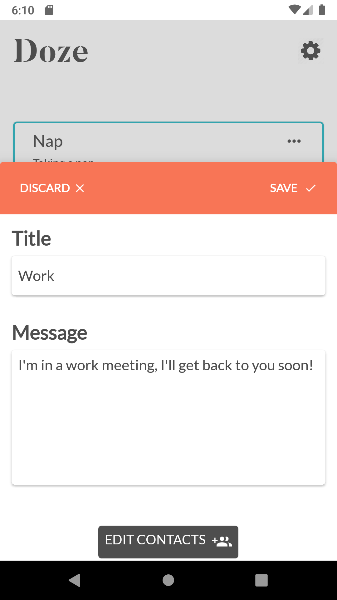
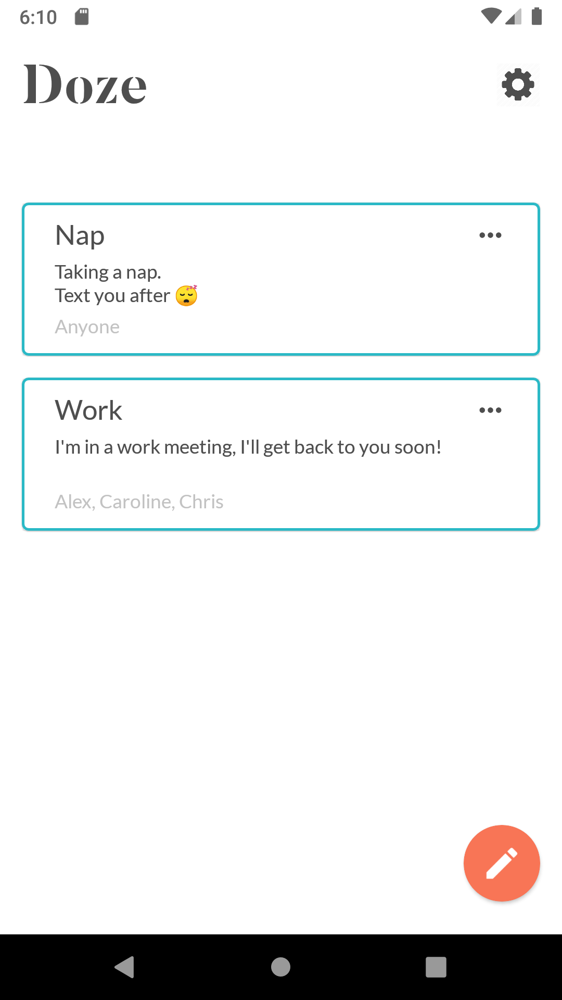
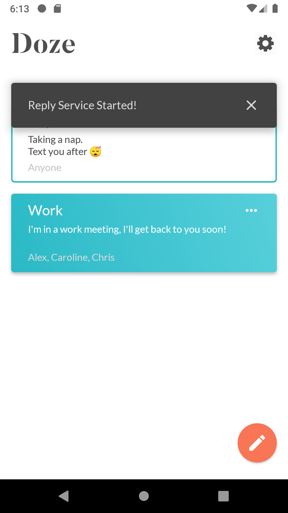
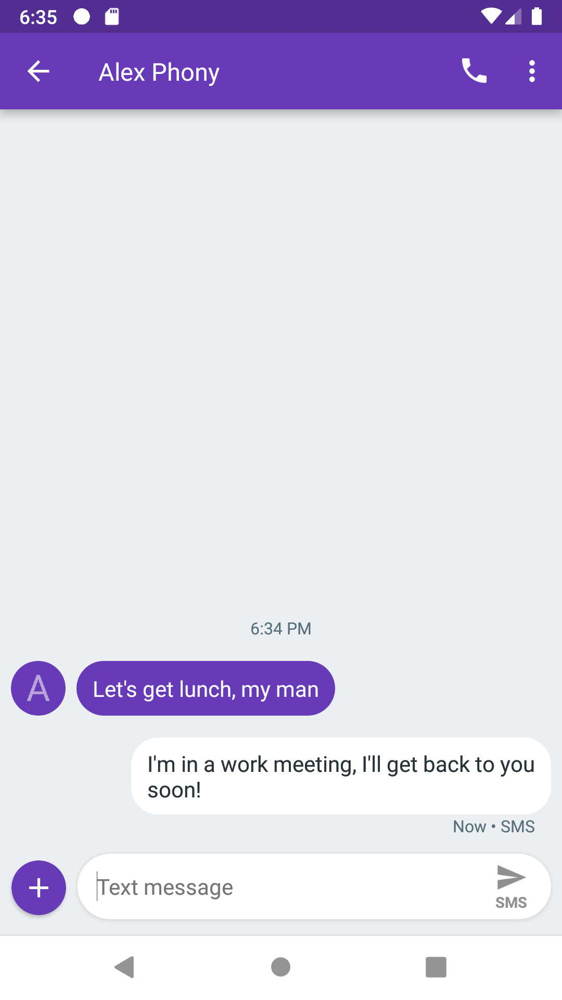

# Doze
Doze is an automatic messaging application written for Android which uses a background service to listen to recieved texts and reply to desired contacts with user-defined messages!

## Examples
{:height="50%" width="50%"}
{:height="50%" width="50%"}
{:height="50%" width="50%"}
{:height="50%" width="50%"}
